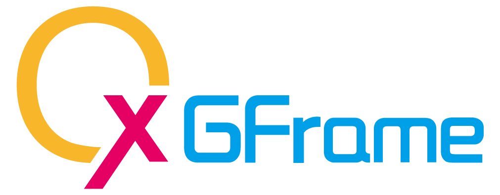

<p align="center">
  
</p>

---

## 新版 OxGFrame 安裝
將舊版 2 以下的 OxGFrame 全部移除，並且重新串接新版的接口。

---

## 基本介紹

OxGFrame 是基於 Unity 用於加快遊戲開發的輕量級框架，並且使用 UniTask 進行異步處理，從資源加載 (AssetLoader)、遊戲介面 (UIFrame)、遊戲場景 (GSFrame)、Unity 場景 (USFrame)、模板物件 (EPFrame)、音樂音效 (AudioFrame)、影片 (VideoFrame)、遊戲階段整合 (GSIFrame)、網路 (NetFrame)、集中式 Event 註冊 (EventCenter)、集中式 API 註冊 (APICenter)、Http.Acax (仿 Ajax 概念) 等都進行模組化設計，能夠簡單入手與有效的加快開發效率，並且支持多平台 Win、OSX、Android、iOS，WebGL。

[Roadmap wiki](https://github.com/michael811125/OxGFrame/wiki/Roadmap)

---

## 需先安裝 (Install via git)
- Install from Package Manager [MyBox version 1.7.0 or higher](https://github.com/Deadcows/MyBox)

---

## 第三方庫 (內建)
- 使用 [UnitTask](https://github.com/Cysharp/UniTask) (最佳異步處理方案)

※備註 : 會持續更新內建第三方庫。

---

## 特別推薦 (內建)

- 使用 [UnityWebSocket](https://github.com/psygames/UnityWebSocket) (最佳 WebSocket 解決方案)
- 使用 [YooAsset](https://github.com/tuyoogame/YooAsset) (強大的資源熱更新方案)
- 使用部分 [UniFramework](https://github.com/gmhevinci/UniFramework) (輕量級框架)
- TODO (待整合) [HybirdCLR](https://github.com/focus-creative-games/hybridclr) (革命性的程式熱更新方案)

※備註 : 會持續更新內建第三方庫。

---

### Unity 低版本如果有遇到 Newtonsoft 問題
- 請自行安裝 [com.unity.nuget.newtonsoft-json](https://github.com/jilleJr/Newtonsoft.Json-for-Unity/wiki/Install-official-via-UPM)

---

## 框架 API
- AssetLoaders (using OxGFrame.AssetLoader)
- AssetPatcher (using OxGFrame.AssetLoader)
- CoreFrames (using OxGFrame.CoreFrame)
- MediaFrames (using OxGFrame.MediaFrame)

※備註 : 建議詳看各模塊的 Example (注意 "res#" 跟 "build#" 的使用規則)。

---

## 模塊框架介紹

### AssetLoader

資源加載器模塊，支援動態 Async 或 Sync 加載 (Dynamic Loading)，採用計數管理方式進行資源管控 (支援 Resources 與 AssetBundle)，如果直接使用 AssetLoaders API 進行 Load 跟 Instantiate，則在 Destroy 物件時，需要連帶調用 Unload (成對呼叫 Load & Unload)。
其中 AssetBundle 集成【[YooAsset](https://github.com/tuyoogame/YooAsset)】實現資源熱更新方案，並且實現【[YooAsset](https://github.com/tuyoogame/YooAsset)】提供的加密介面，其中實現加解密方式有 Offset (偏移量方式)、XOR、HTXOR (Head-Tail XOR)、AES 實現檔案加密。

※備註 : Use "res#" will load from Resources else load from Bundle

**選擇使用 Bundle 開發時，需要先將 PatchLauncher 拖曳至場景中，才能驅動相關配置。**

- FileCryptogram (檔案加解密)
  - 運算效率 HTXOR ~= OFFSET > XOR > AES
  - 內存占用 OFFSET > AES > HTXOR = XOR 
  - AB 包體積增加 OFFSET > AES > HTXOR = XOR
  - 破解難度 AES > HTXOR > XOR > OFFSET

### 資源熱更新方案【[YooAsset](https://github.com/tuyoogame/YooAsset)】

使用 YooAsset Collector 進行資源收集 (可以使用 ActiveRule 決定哪些群組需要打包，進行 Built-in 跟 Patch 資源的區分)，再使用 YooAsset Builder 進行打包 **(不需手動更改資源日期版號)**，如有 Bundle 加密需求需先配置加密設定 YooAsset/OxGFrame Cryptogram Setting With YooAsset。

再使用 OxGFrame/AssetLoader/Bundle Config Generator 進行配置檔建立。

1. 先進行 Export App Config To StreamingAssets 建立 appconfig.json 至 StreamingAssets 中 (主要用於 App Version 比對)。
2. 再選擇 Export Configs And App Bundles for CDN 輸出上傳資源，Source Folder 選擇剛剛使用 YooAsset 輸出的 Bundles 資料夾，依照自己需求是否有想要使用 Tags 進行預設包的群組分包，輸出後將 CDN 資料夾直接上傳至 Server。
   
- 群組分包舉例
  - 最小運行包
  - 標準運行包
  - 全部運行包 (預設 #all)


---

**將 PatchLauncher 拖曳至場景中後，可以設置 PlayMode**
- Editor Simulate Mode (模擬模式 [加快開發])，需先配置 YooAsset Collector。
- Offline Mode (單機模式)，需將 AB 打包至 Built-in，並且產出相關配置，需注意 PatchLauncher 的解密設定。
- Host Mode (聯機模式)，需將 AB 打包區分 Built-in 跟 Patch，並且產出相關配置，需注意 PatchLauncher 的解密設定。
  - 允許選擇 Semantic Version 版號檢查規則 (比對完整版號 X.Y.Z 或比對大小版號 X.Y)。
  - 允許跳過 Default Package 主下載器的下載階段 (強制邊玩邊下載)。

**檢查 PlayMode 是否初始完成**
- 判斷檢查 AssetPatcher.IsInitialized() 是否初始完成，因為初始完成後，才能開始進行 Bundle 加載。
  - 備註 : 區分 Built-in 跟 Patch (視情況自行訂定運作流程)
    1. 需自己拆分 Patch 更新前用到的資源 (例如 : LogoUI, PatchUI 等...)，需要先打包至 Built-in 作為內置資源。
	2. 後續執行 AssetPatcher.Check() 檢查 Patch 更新完成後，就可以讀取更新資源了。
	
**檢查 Patch 是否更新完成**
- 判斷檢查 AssetPatcher.IsDone() 是否更新完成。

**指定特定的 Package 進行資源加載**
- 需先手動進行 AssetPatcher.InitPackage 的初始 (如果 autoUpdate = false，則需要自行另外調用 AssetPatcher.UpdatePackage 進行 Manifest 的更新)。
- 支援特定版本 DLC package 的下載與 DLC package 卸載功能，需手動進行 AssetPatcher.InitDlcPackage，並且指定特定 dlcVersion，對於 dlcVersion 也可以單一固定 dlcVersion，變成只要 DLC 有更新就可以使用固定路徑進行更新。
```
// [Load asset and download from specific package (Export App Bundles for CDN)]

var packageName = "OtherPackage";
bool isInitialized = await AssetPatcher.InitPackage(packageName, true);
if (isInitialized)
{
    var package = AssetPatcher.GetPackage(packageName);
    var downloader = AssetPatcher.GetPackageDownloader(package);
    Debug.Log($"Has In Local: {downloader.TotalDownloadCount == 0}, Patch Count: {downloader.TotalDownloadCount}, Patch Size: {BundleUtility.GetBytesToString((ulong)downloader.TotalDownloadBytes)}");
    await AssetLoaders.LoadAssetAsync<GameObject>(packageName, assetName);
}
```

```
// [Load asset and download from specific package (Export Individual DLC Bundles for CDN)]

var packageName = "DlcPackage";
bool isInitialized = await AssetPatcher.InitDlcPackage(packageName, "dlcVersion", true);
if (isInitialized)
{
    var package = AssetPatcher.GetPackage(packageName);
    var downloader = AssetPatcher.GetPackageDownloader(package);
    Debug.Log($"Has In Local: {downloader.TotalDownloadCount == 0}, Patch Count: {downloader.TotalDownloadCount}, Patch Size: {BundleUtility.GetBytesToString((ulong)downloader.TotalDownloadBytes)}");
    await AssetLoaders.LoadAssetAsync<GameObject>(packageName, assetName);
}
```

---

#### Bundle [burlconfig] (Bundle URL Config) 格式

格式如下 **(store_link 針對非 Android, iOS 平台的，可以設置主程式下載的 link)**

```
# bundle_ip = First CDN Server IP (Plan A)
# bundle_fallback_ip = Second CDN Server IP (Plan B)
# store_link = GooglePlay Store Link (https://play.google.com/store/apps/details?id=YOUR_ID) or Apple Store Link (itms-apps://itunes.apple.com/app/idYOUR_ID)

bundle_ip 127.0.0.1
bundle_fallback_ip 127.0.0.1
store_link http://
```

**\>\> 建立 burlconfig.conf 方式 \<\<**
- 使用 OxGFrame/AssetLoader/Bundle Url Config Generator 創建 burlconfig.conf (StreamingAssets/burlconfig.conf)。

**如果沒有要使用 AssetLoader 資源加載模塊，可以直接刪除整個 AssetLoader (注意有模塊依賴引用)。**

---

### CoreFrame (dependence AssetLoader)

核心模塊 (連動 AssetLoader 實現自動卸載)，包含用於製作 UI, Game Scene, Entity Prefab, Unity Scene，針對製作對應使用 UI Prefab => UIFrame、Game Scene Prefab => GSFrame、Other Prefab => EPFrame、Unity Scene => USFrame。支援 Resources 與 AssetBundle 加載方式，並且實現物件命名綁定功能 (UIBase and GSBase = _Node@XXX, EPBase = ~Node@XXX, 類型均為 GameObject)。

- UIFrame (User Interface) : 使用 UIManager 管理掛載 UIBase 的 Prefab，有凍結 UI 功能，避免 UI 動畫尚未完成期間，能夠觸發事件，需要進行 ShowAnime 跟 HideAnime override，並且需要正確保留 callback，另外 UI 的 MaskEvent 可以 override 自定義事件 (使用 _Node@XXX 進行物件綁定)
- GSFrame (Game Scene) : 使用 GSManager 管理掛載 GSBase 的 Prefab (使用 _Node@XXX 進行物件綁定)
- USFrame (Unity Scene) : 使用 USManager 管理 Unity 場景 (支援 AssetBundle)
  - ※備註 : Use "build#" will load scene from Build else load scene from Bundle
- EPFrame (Entity Prefab) : 使用 EPManager 管理掛載 EPBase 的 Prefab (使用 ~Node@XXX 進行綁定)，可以用於加載模板物件，並且直接進行 GameObject.Destroy 就好，將會自動卸載。

#### 常用方法說明
- OnInit : 初始 Member Params (建構式概念)，另外如果採用拖曳式指定組件，也可以直接在此初始 (不過不建議，建議還是在 OnBind 執行)。
- OnBind : 初始綁定組件與事件 (After Bind)。
- OpenSub : 當有異步處理或者附屬物件控制時，可以在此處理。例如 : TopUI 附屬連動開啟 LeftUI & RightUI，那麼就可以在 TopUI 中的 OpenSub 方法實現 Show LeftUI & RightUI。
- OnShow : 調用 Show 時，此方法會被激活，並且可以透過帶入的 object 進行數據傳送。
- OnClose : 調用 Close 時，此方法會被激活。
- OnRelease : 當物件 Close And Destroy 時，此方法會被激活。

#### 初始順序說明
Init Order : Awake (Once) > OnInit (Once) > OnBind (Once) > PreInit (EveryOpen) > OpenSub (EveryOpen) > OnShow (EveryOpen)

#### 物件綁定說明 (OnBind)
- 透過 collector.GetNode("BindName") 返回取得綁定 GameObject (單一名綁定)
  - UIBase & GSBase 使用 _Node@XXX
  - EPBase 使用 ~Node@XXX
- 透過 collector.GetNodes("BindName") 返回取得綁定 GameObject[] (同名多綁定，物件順序由上至下)
  - UIBase & GSBase 使用 _Node@XXX
  - EPBase 使用 ~Node@XXX

**如果沒有要使用 CoreFrame 核心製作模塊，可以直接刪除整個 CoreFrame。**

※備註 : Right-Click Create/OxGFrame/CoreFrame... (Template cs and prefab)

---

### MediaFrame (dependence AssetLoader)

影音模塊 (連動 AssetLoader 實現自動卸載)，包含用於製作 Audio (2D/3D), Video 遊戲影音，支援多平台加載方式 (Local, StreamingAssets, URL)，主要也對於 WebGL 有進行細節校正，因為 WebGL 對於 Audio 請求部分是無法取得正確長度 (官方放棄修正)，導致音訊控制會有部分缺陷，所以支援預置體製作時，可進行 Preload 請求 Clip 長度進行預設置。

- AudioFrame : 使用 AudioManager 管理掛載 AudioBase 的 Prefab，且採用 Unity Mixer 進行各音軌控制 **(需先將 AudioManager 預置體拖至場景)**
- VideoFrame : 使用 VideoManager 管理掛載 VideoBase 的 Prefab，且支援 RenderTexture, Camera

#### Audio Sound Type 說明
- Sole : 唯一性 (不能重複播放)，建議 BGM (背景音樂), Voice (配音)
- SoundEffect : 多實例 (可以重複播放)，建議 Fight Sound (戰鬥音效), General Sound (一般音效)

#### Video Render Mode 說明
- RenderTexture : 將 Video 映射至 RenderTexture 再透過 UGUI 的 RawImage 進行渲染 (VideoBase 使用 RenderTexture.GetTemporary 跟 RenderTexture.ReleaseTemporary 創建與釋放，確保內存正確釋放 RenderTexture)
- Camera : 直接透過 Camera 進行渲染。

#### Media [murlconfig] (Media URL Config) 格式

如果音訊跟影片來源存放於 Server，可以使用 URL 的方式進行檔案請求，格式如下 **(如果不透過 murlconfig.txt 指定 URL 的話，也可以輸入完整資源 URL 至 Prefab 中，不過缺點就是對於未來更動 URL，要進行更改維護就會非常麻煩)**

```
# audio_urlset = Audio Source Url Path
# video_urlset = Video Source Url Path

audio_urlset 127.0.0.1/audio/
video_urlset 127.0.0.1/video/
```

**\>\> 建立 murlconfig.txt 方式 \<\<**
- 使用 OxGFrame/MediaFrame/Media Url Config Generator 創建 murlconfig.txt (StreamingAssets/murlconfig.txt)。

**\>\> 加載 murlconfig.txt 方式 \<\<**
1. 如果選擇 Url Cfg Request Type = Assign 的方式指定 murlconfig.txt 至 prefab 中。
2. 如果選擇 Url Cfg Request Type = Streaming Assets 的方式請求 murlconfig.txt，將 murlconfig.txt 放至 StreamingAssets 根目錄中 (StreamingAssets/murlconfig.txt)。

**額外說明**：如果透過 URL 方式請求音訊或影片資源，建議於 WebGL 平台上使用，因為 WebGL 不支援 AssetBundle 事先指定 AudioClip 或 VideoClip (Assign 方式) 至 Prefab 中，所以提供 URL 的方式進行影音檔請求。

**如果沒有要使用 MediaFrame 影音模塊，可以直接刪除整個 MediaFrame。**

※備註 : Right-Click Create/OxGFrame/MediaFrame... (Template prefab)

---

### GSIFrame

遊戲階段整合模塊 (FSM 概念)，而 GSI 為 Game Stage Integration 的縮寫，對於遊戲製作的時候缺乏整合系統，導致遊戲系統運作之間過於零散，基本上遊戲階段區分為 StartupStage (啟動階段), LogoStage (商業Logo階段), PatchStage (資源熱更階段), LoginStage (登入階段), ReloginStage (重登階段), EnterStage (進入階段), GamingStage (遊玩階段), FightStage (戰鬥階段) 等, 以上只是舉例大致上遊戲階段之間的劃分，基本上還是依照自己規劃創建為主，這些遊戲階段規劃好後，都可以使用 GSIFrame 進行整合與切換 (階段劃分後就可以自行實現每階段的運作)。

- GSIBase，遊戲階段基類，在透過 Update 切換當前階段自定義的狀態流程 (Enum) 時，可透過 StopUpdate & RunUpdate 方法進行開關設置，即可停止或繼續 Update 的每幀調用，需建立實作 => 右鍵創建
- GSIManagerBase，用於繼承實現管理層與註冊階段，需建立實作 => 右鍵創建

**如果沒有要使用 GSIFrame 遊戲整合模塊，可以直接刪除整個 GSIFrame。**

※備註 : Right-Click Create/OxGFrame/GSIFrame... (Template cs)

---

### NetFrame (dependence Utility)

網路模塊，實現 WebSocket 跟 TCP/IP 統一接口，依照 WebSocket 狀態概念進行接口設計 (ISocket)，狀態分為 OnOpen, OnMessage, OnError, OnClose，進行事件註冊後就可以針對網路狀態進行監控，也實現多網路節點 (NetNode)，可以自行建立 WebSocket NetNode 或是 TCP/IP NetNode，再由 NetManager 進行網路節點註冊進行管理操作，另外可以設置心跳檢測回調、超時處理回調、重新連接回調的各處理，並且也能實現 INetTips 接口網路訊息介面的實作。

- NetManager (網路節點管理器)
- NetNode (網路節點)
- TcpSock (TCP/IP)
- WebSock (WebSocket)
- INetTips (網路狀態提示接口)

**如果沒有要使用 NetFrame 網路模塊，可以直接刪除整個 NetFrame。**

---

### EventCenter

集中式 Event 整合模塊 (非多監聽式)，可以自定義每個 Event 的格式進行派送。

- EventCenter : 事件註冊調度管理，管理基類已實現單例
  - EventBase，單個 Event 基類，需建立實作 => 右鍵創建
  - EventCenterBase，用於繼承實現管理層與註冊階段，需建立實作 => 右鍵創建
  
**如果沒有要使用 EventCenter 事件模塊，可以直接刪除整個 EventCenter。**
  
※備註 : Right-Click Create/OxGFrame/EventCenter... (Template cs)

---

### APICenter

集中式 API 整合模塊，可以自定義每個 API 的格式進行短連接請求，能夠有效的集中管理各型式的 API 格式，。

- Acax (類似 Ajax 方式，請求 API)，支援 Async & Sync
- APICenter : Http API 註冊管理，管理基類已實現單例
  - APIBase，單個 API 基類，需建立實作 => 右鍵創建
  - APICenterBase，用於繼承實現管理層與註冊階段，需建立實作 => 右鍵創建

**如果沒有要使用 APICenter 短連接請求模塊，可以直接刪除整個 APICenter。**

※備註 : Right-Click Create/OxGFrame/APICenter... (Template cs)

---

### Utility

各通用組件

- Utility 
  - Timer => DeltaTimer, RealTimer, DTUpdate, RTUpdate
    - ※備註 : RealTimer 啟用條件需要由 Main Monobehaviour Awake 調用 RealTime.InitStartupTime() 進行初始。
  - Adapter => UISafeAreaAdapter
    - ※備註 : 在 Canvas 下預創建 UIRoot 並掛載 UISafeAreaAdapter 在 UIRoot 上 (也可使用自己的 UI 自適應方案)。
  - Pool => NodePool (GameObject Pool)
  - ButtonPlus => Inherited by Unity Button. extend Long Press and Transition Scale
  - UMT => Unity Main Thread
    - ※備註 : 需先拖曳 UnityMainThread Prefab 至場景上 (由 Monobehaviour 主線程驅動)。

**如果沒有要使用 Utility 通用組件，可以直接刪除整個 Utility (注意有模塊依賴引用)。**

---

### Unity 版本

建議使用 Unity 2021.3.23f1(LTS) or higher 版本 - [Unity Download](https://unity3d.com/get-unity/download/archive)

---

### 基於 OxGFrame 實現的小遊戲

[FlappyBird_OxGFrame 簡易版](https://github.com/michael811125/FlappyBird_OxGFrame)

---

### 歡迎加入一起交流 (QQ 315262286)

---

## License

This library is under the MIT License.