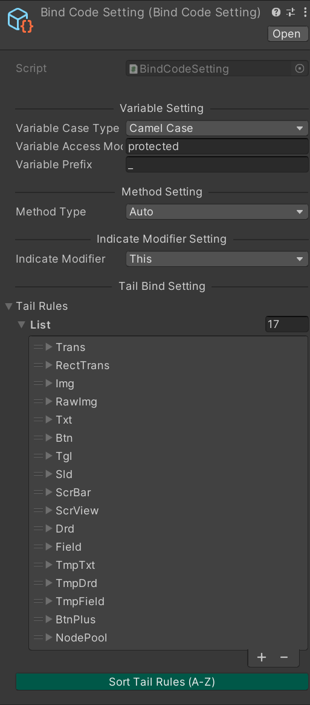

<p align="center">
  
</p>

[](https://github.com/michael811125/OxGFrame/blob/master/LICENSE.md)

---

## 官方主頁 (OxGFrame with [YooAsset](https://github.com/tuyoogame/YooAsset) + [HybridCLR](https://github.com/focus-creative-games/hybridclr))

- [官方文檔](https://oxgframe.ouhiyo.com/)

- [快速上手 (安裝教程)](https://oxgframe.ouhiyo.com/docs/getting-started)

---

## 常用與依賴的工具庫

- ### [OxGKit](https://github.com/michael811125/OxGKit)

---

## 使用 OxGFrame 實現的 Demo 小遊戲

[Github - FlappyBird_OxGFrame](https://github.com/michael811125/FlappyBird_OxGFrame)
  - [Resources](https://github.com/michael811125/FlappyBird_OxGFrame/tree/resources)
  - [AssetBundle](https://github.com/michael811125/FlappyBird_OxGFrame/tree/assetbundle)
  - [AssetBundle + HybridCLR](https://github.com/michael811125/FlappyBird_OxGFrame/tree/assetbundle_clr)

https://github.com/michael811125/OxGFrame/assets/30960759/5e41e84a-029d-4392-8142-7199ce45018c

---

## Wiki
- [Coding Style wiki (代碼風格)](https://github.com/michael811125/OxGFrame/wiki/Coding-Style)
- [Macro Defitions wiki (宏定義)](https://github.com/michael811125/OxGFrame/wiki/Macro-Definitions)
- [Encryption and Decryption Efficiency wiki (加解密效率)](https://github.com/michael811125/OxGFrame/wiki/Encryption-and-Decryption-Efficiency-Reference)
- [Roadmap wiki](https://github.com/michael811125/OxGFrame/wiki/Roadmap)

## 基本介紹

OxGFrame 是基於 Unity 用於加快遊戲開發的框架，並且使用 UniTask 進行異步處理，從資源加載 (AssetLoader)、遊戲介面 (UIFrame)、場景資源 (SRFrame)、Unity 場景 (USFrame)、模板物件 (CPFrame)、音樂音效 (AudioFrame)、影片 (VideoFrame)、遊戲階段整合 (GSIFrame)、網路 (NetFrame)、事件中心 (CenterFrame)，能夠簡單入手與有效的加快開發效率，並且支持多平台 Win、OSX、Android、iOS、WebGL。

**平台測試**
- Windows (Passed)
- MacOSX (Passed)
- Android (Passed)
- iOS (Passed)
- WebGL (Passed)

https://github.com/michael811125/OxGFrame/assets/30960759/fd04f6e5-6338-400c-9f57-dcdbdf73dfff

相關模板建立的選單 (Create menu items)


---

## 模塊框架介紹

- [Hotfixer](https://github.com/michael811125/OxGFrame#hotfixer-dependence-hybridclr-assetloader)
- [AssetLoader](https://github.com/michael811125/OxGFrame#assetloader-dependence-yooasset)
- [CoreFrame](https://github.com/michael811125/OxGFrame#coreframe-dependence-assetloader)
- [MediaFrame](https://github.com/michael811125/OxGFrame#mediaframe-dependence-assetloader)
- [GSIFrame](https://github.com/michael811125/OxGFrame#gsiframe)
- [NetFrame](https://github.com/michael811125/OxGFrame#netframe-dependence-oxgkitutilities)
- [CenterFrame](https://github.com/michael811125/OxGFrame#centerframe)


### Hotfixer (dependence HybridCLR, AssetLoader)

代碼熱修復模塊，使用 [HybridCLR](https://github.com/focus-creative-games/hybridclr) (前身 Huatuo) 革命性的熱更新方案進行整合，相關建置請前往[官方文檔](https://hybridclr.doc.code-philosophy.com/)進行熟悉。
- 如果相關建置完畢，前往點選 HybridCLR/OxGFrame With HybirdCLR/Complie And Copy To HotfixCollector，將會幫忙拷貝至 **HotfixCollector** 文件夾，再使用 YooAsset Collector 進行收集打包。

**使用流程詳看 HotfixerDemo (Import frome Package Manager)**


※備註 : 運行打包 HotfixerDemo 需要 Import PatchLauncher from PackageManager

---

### AssetLoader (dependence YooAsset)

資源加載器模塊，支援動態 Async 或 Sync 加載 (Dynamic Loading)，採用計數管理方式進行資源管控 (支援 Resources 與 AssetBundle)，如果直接使用 AssetLoaders API 進行 Load 跟 Instantiate，則在 Destroy 物件時，需要連帶調用 Unload (成對呼叫 Load & Unload)。
其中 AssetBundle 集成 YooAsset 實現資源熱更新方案，並且實現 YooAsset 提供的加密介面，其中實現加解密方式有 Offset (偏移量方式)、XOR、HT2XOR (Head-Tail 2 XOR)、HT2XOR-Plus (Head-Tail 2 XOR Plus)、AES、ChaCha20、XXTEA、OffsetXOR 實現文件加密。

※備註 : Use "res#" will load from Resources else load from Bundle

※提醒 : 如果要使用同步加載，資源一定要是事先下載完成的 (主要是資源不在本地時，請求下載部分是異步處理)，也提醒同步加載只適合小資源 (當然強烈建議全部都使用異步處理)。

**選擇使用 Bundle 開發時，需要先將 PatchLauncher 拖曳至場景中，才能驅動相關配置。【如果使用 PakcageManager 安裝的，透過 Samples Import PatchLauncher Prefab】**

- FileCryptogram (文件加解密 - 僅供參考)
  - 運算效率 Offset > HT2XOR > XOR >= OffsetXOR >= HT2XORPlus > XXTEA > ChaCha20 > AES
  - 內存占用 Offset ≈ OffsetXOR > AES ≈ ChaCha20 > XXTEA > HT2XORPlus = HT2XOR = XOR 
  - AB 包體積增加 Offset ≈ OffsetXOR > AES ≈ ChaCha20 > XXTEA > HT2XORPlus = HT2XOR = XOR
  - 破解難度 AES ≈ ChaCha20 > XXTEA > HT2XORPlus > HT2XOR > OffsetXOR > XOR > Offset

#### 群組分包舉例
  - 最小運行包
  - 標準運行包
  - 全部運行包 (預設索引標籤為 #all)


#### 資源更新過程 (支援下載途中直接進行修復功能)

https://github.com/michael811125/OxGFrame/assets/30960759/11dcf0d3-41bd-4a8d-af6b-7115374552f5


#### 是否啟用 Disk Space 檢查流程


#### 使用 PackageOperation 進行 DLC 資源包的操作 (方便控管資源包)

https://github.com/michael811125/OxGFrame/assets/30960759/694d1125-cf9f-42bb-85f4-df42041057c7

```C#
    // Use Example
    var packageOperations = new PackageOperation[]
    {
        new PackageOperation
        (
            "DLC Package 1",
            new DlcPackageInfoWithBuild()
            {
                buildMode = BuildMode.ScriptableBuildPipeline,
                packageName = "Dlc1Package",
                dlcVersion = "latest"
            },
            false
        ),
        new PackageOperation
        (
            "DLC Pacakge 2",
            new DlcPackageInfoWithBuild()
            {
                buildMode = BuildMode.ScriptableBuildPipeline,
                packageName = "Dlc2Package",
                dlcVersion = "latest"
            },
            false
        )
    };
```

**App Package**
```C#
// [Load asset and download from specific package (Export App Bundles for CDN)]

AppPackageInfoWithBuild packageInfo = new AppPackageInfoWithBuild()
{
    buildMode = BundleConfig.BuildMode.ScriptableBuildPipeline,
    packageName = "OtherPackage"
};

bool isInitialized = await AssetPatcher.InitAppPackage(packageInfo, true);
if (isInitialized)
{
    var package = AssetPatcher.GetPackage(packageName);
    var downloader = AssetPatcher.GetPackageDownloader(package);
    Debug.Log($"Has In Local: {downloader.TotalDownloadCount == 0}, Patch Count: {downloader.TotalDownloadCount}, Patch Size: {BundleUtility.GetBytesToString((ulong)downloader.TotalDownloadBytes)}");
    await AssetLoaders.LoadAssetAsync<GameObject>(packageName, assetName);
}
```

**DLC Package**
```C#
// [Load asset and download from specific package (Export Individual DLC Bundles for CDN)]

DlcPackageInfoWithBuild packageInfo = new DlcPackageInfoWithBuild()
{
    buildMode = BundleConfig.BuildMode.ScriptableBuildPipeline,
    packageName = "DlcPackage",
    dlcVersion = "dlcVersion",
    withoutPlatform = false
};

bool isInitialized = await AssetPatcher.InitDlcPackage(packageInfo, true);
if (isInitialized)
{
    var package = AssetPatcher.GetPackage(packageName);
    var downloader = AssetPatcher.GetPackageDownloader(package);
    Debug.Log($"Has In Local: {downloader.TotalDownloadCount == 0}, Patch Count: {downloader.TotalDownloadCount}, Patch Size: {BundleUtility.GetBytesToString((ulong)downloader.TotalDownloadBytes)}");
    await AssetLoaders.LoadAssetAsync<GameObject>(packageName, assetName);
}
```

#### Bundle [burlconfig] (Bundle URL Config) 格式

格式如下，以下為明文類型 **(store_link 針對非 Android, iOS 平台的，可以設置主程式下載的 link)**
- 支持 Cipher Type (密文類型)
- 支持 Plaintext Type (明文類型)

```
# bundle_ip = First CDN Server IP or Domain (Plan A)
# bundle_fallback_ip = Second CDN Server IP or Domain (Plan B)
# store_link = GooglePlay Store Link (https://play.google.com/store/apps/details?id=YOUR_ID)
# store_link = Apple Store Link (https://apps.apple.com/app/idYOUR_ID)

bundle_ip http://127.0.0.1
bundle_fallback_ip http://127.0.0.1
store_link http://
```

---

### CoreFrame (dependence AssetLoader)

核心模塊 (連動 AssetLoader 實現自動卸載)，包含用於製作 UI, Scene Resource, Clone Prefab, Unity Scene，針對製作對應使用 UI Prefab => UIFrame、Scene Resource Prefab => SRFrame、Other Prefab => CPFrame、Unity Scene => USFrame。支援 Resources 與 AssetBundle 加載方式，並且實現物件命名綁定功能 (UIBase and SRBase = _Node@XXX, CPBase = ~Node@XXX, 類型均為 GameObject)。

#### UIFrame (User Interface)

用於調度 UI Prefab，僅支援 UGUI，使用 UIManager 管理掛載 UIBase 的 Prefab，支援 UI 反切 (Reverse Changes)、UI 堆疊關閉 (Close Stack By Stack)，基本上 UI 有隱藏凍結功能，避免 UI 動畫尚未完成期間，能夠被點擊觸發事件。另外如需要製作 UI 動畫，可以在 ShowAnimation 跟 HideAnimation 覆寫執行相關過渡動畫 (DoTween, Animation...)，並且一定要在完成 UI 動畫後正確呼叫 animationEnd() 回調。額外還有 UI 的 MaskEvent 也可以 override 自定義事件 (使用 _Node@XXX 進行物件綁定)。

| UI 反切運用 (Reverse Changes)  | UI 反切運用 (Reverse Changes) |
|:-|:-|
|  |  |

| UI 堆疊關閉運用 (Close Stack By Stack)  | UI 堆疊關閉運用 (Close Stack By Stack) |
|:-|:-|
|  |  |

#### SRFrame (Scene Resource)

用於調度場景或資源物件 Prefab，使用 SRManager 管理掛載 SRBase 的 Prefab (使用 _Node@XXX 進行物件綁定)。

#### USFrame (Unity Scene)

用於調度 Unity Scene，使用 USManager 管理 Unity 場景 (支援 AssetBundle)。
- ※備註 : Use "build#" will load scene from Build else load scene from Bundle

#### CPFrame (Clone Prefab)

用於實例 Prefab 模板物件，使用 CPManager 管理掛載 CPBase 的 Prefab (使用 ~Node@XXX 進行綁定)，可以用於加載模板物件，並且直接進行 GameObject.Destroy 就好，將會自動卸載。

#### 常用方法說明

- OnCreate : 初始 Member Params (建構式概念)，另外如果採用拖曳式指定組件，也可以直接在此初始 (不過不建議，建議還是在 OnBind 執行)。
- OnBind : 初始綁定組件與事件 (After Bind)。
- OnPreShow : 當有異步處理或者附屬物件控制時，可以在此處理。例如 : TopUI 附屬連動開啟 LeftUI & RightUI，那麼就可以在 TopUI 中的 OnPreShow 方法實現 Show LeftUI & RightUI。
  - **不建議在 OnPreClose 時進行相關 Show 的處理，如果有進行的話也沒關係，因為針對 CloseAll 的 API 有提供 disabledPreClose 的開關。**
- OnShow : 調用 Show 時，此方法會被激活，並且可以透過帶入的 object 進行數據傳送。
- OnClose : 調用 Close 時，此方法會被激活。
- OnRelease : 當物件被 Destroy 時，此方法會被激活。

#### 初始順序說明

Init Order : OnCreate (Once) > OnAutoBind (Once) > OnBind (Once) > OnPreShow (EveryOpen) > OnShow (EveryOpen)

#### 物件綁定獲取說明 (OnBind)

- 透過 collector.GetNode("BindName") 返回取得綁定 GameObject (單一名綁定)
  - UIBase & SRBase 使用 _Node@XXX
  - CPBase 使用 ~Node@XXX
- 透過 collector.GetNodes("BindName") 返回取得綁定 GameObject[] (同名多綁定，物件順序由上至下)
  - UIBase & SRBase 使用 _Node@XXX
  - CPBase 使用 ~Node@XXX
- 透過 collector.GetNodeComponent\<TComponent\>("BindName") 返回取得綁定 TComponent (單一名綁定)
  - UIBase & SRBase 使用 _Node@XXX
  - CPBase 使用 ~Node@XXX
- 透過 collector.GetNodeComponents\<TComponent\>("BindName") 返回取得綁定 TComponent[] (同名多綁定，物件順序由上至下)
  - UIBase & SRBase 使用 _Node@XXX
  - CPBase 使用 ~Node@XXX

***建議使用 Hotkey，不然使用 Right-Click 會執行多次 (實際上不影響自動生成)，但這是 [Unity Bug](https://issuetracker.unity3d.com/issues/menuitem-is-executed-more-than-once-when-multiple-objects-are-selected) 官方不修復了***

#### 自動生成停止綁定標籤 (Hotkey: Shift+E, E: End)

能夠縮短 Runtime 在綁定的向下查找次數，時間複雜度為 O(N)，N = StopEndIdx (**如有大量節點物件建議使用**)。
  - 如果有特殊使用 Transform.Find 查找子物件時，剛好子物件名稱有 # 標籤，可以無視 (在 Runtime 時，會 Replace 標籤，還原字串)。


#### 自動生成物件綁定代碼 (Hotkey: Shift+B, B: Bind)

命名規範使用 * 指向 TailName
- UIBase & SRBase
  - _Node@XXX\*Btn (以此類推)
  - _Node@XXX\*Btn\*Img\*Trans (以此類推，支持多個 \* 指向多 TailName)
- CPBase
  - ~Node@XXX\*Btn (以此類推)
  - ~Node@XXX\*Btn\*Img\*Trans (以此類推，支持多個 \* 指向多 TailName)

綁定說明


綁定配置



預設組件綁定表 (可從 CodeBindingSettings 中自行新增或修改 TailName 對應綁定組件類型)

| **Tail Name** | **Component Name** | **End Remove Count** | **End Plural Txt** |
|:-|:-|:-|:-|
| **Other** |
| Trans | Transform | 0 | es |
| RectTrans | RectTransform | 0 | es |
| **Legacy** |
| Img | Image | 0 | s |
| RawImg | RawImage | 0 | s |
| Txt | Text | 0 | s | 
| Btn | Button | 0 | s | 
| Tgl | Toggle | 0 | s | 
| Sld | Slider | 0 | s | 
| ScrBar | Scrollbar | 0 | s | 
| ScrView | ScrollRect | 0 | s | 
| Drd | Dropdown | 0 | s | 
| Field | InputField | 0 | s | 
| **TMP** |
| TmpTxt | TMP_Text | 0 | s | 
| TmpDrd | TMP_Dropdown | 0 | s | 
| TmpField | TMP_InputField | 0 | s |
| **Custom** |
| BtnPlus | ButtonPlus | 0 | es |
| NodePool | NodePool | 0 | s |

自動綁定產生器的功能有方法類型的區分，如下
- 自動 (Auto) \[預設\]，自動儲存綁定內容至代碼中，將會自動 override OnAutoBind() 與調用。

https://github.com/michael811125/OxGFrame/assets/30960759/4c61bede-0bbc-4cae-baba-4a9bc7274c2e

- 手動 (Manual) \[自選\]，手動將綁定內容複製至代碼中，將會自動 override OnAutoBind() 與調用。

https://github.com/michael811125/OxGFrame/assets/30960759/8e4f63e9-b955-4f91-8ac7-be949677c54f

※備註 : Right-Click Create/OxGFrame/Core Frame... (Template cs and prefab)

---

### MediaFrame (dependence AssetLoader)

影音模塊 (連動 AssetLoader 實現自動卸載)，包含用於製作 Audio (2D/3D), Video 遊戲影音，支援多平台加載方式 (Local, StreamingAssets, URL)，主要也對於 WebGL 有進行細節校正，因為 WebGL 對於 Audio 請求部分是無法取得正確長度 (官方放棄修正)，導致音訊控制會有部分缺陷，所以支援預置體製作時，可進行 Preload 請求 Clip 長度進行預設置。

#### AudioFrame

用於播放 Audio，使用 AudioManager 管理掛載 AudioBase 的 Prefab，且採用 Unity Mixer 進行各音軌控制。 

**(需先將 AudioManager 預置體拖至場景)【如果使用 PakcageManager 安裝的，透過 Samples Import AudioManager Prefab】**

- Audio Sound Type 說明
  - Sole : 唯一性 (不能重複播放)，建議種類為 BGM (背景音樂), Voice (配音) 等。
  - SoundEffect : 多實例 (可以重複播放)，建議種類為 Fight Sound (戰鬥音效), General Sound (一般音效) 等。

#### VideoFrame

用於播放 Video，使用 VideoManager 管理掛載 VideoBase 的 Prefab，且支援 RenderTexture, Camera。
- Video Render Mode 說明
  - RenderTexture : 將 Video 映射至 RenderTexture 再透過 UGUI 的 RawImage 進行渲染 (VideoBase 使用 RenderTexture.GetTemporary 跟 RenderTexture.ReleaseTemporary 創建與釋放，確保內存正確釋放 RenderTexture)。
  - Camera : 直接透過 Camera 進行渲染。

#### Media [murlconfig] (Media URL Config) 格式

如果音訊跟影片來源存放於 Server，可以使用 URL 的方式進行文件請求，格式如下 **(如果不透過 murlconfig.txt 指定 URL 的話，也可以輸入完整資源 URL 至 Prefab 中，不過缺點就是對於未來更動 URL，要進行更改維護就會非常麻煩)**

```
# audio_urlset = Audio Source Url Path
# video_urlset = Video Source Url Path

audio_urlset 127.0.0.1/audio/
video_urlset 127.0.0.1/video/
```

**\>\> 建立 murlconfig.txt 方式 \<\<**
- 使用 OxGFrame/MediaFrame/Media Url Config Generator 創建 murlconfig.txt (StreamingAssets/murlconfig.txt)。

**\>\> 加載 murlconfig.txt 方式 \<\<**
1. 如果選擇 Url Cfg Request Type = Assign 的方式指定 murlconfig.txt 至 prefab 中。
2. 如果選擇 Url Cfg Request Type = Streaming Assets 的方式請求 murlconfig.txt，將 murlconfig.txt 放至 StreamingAssets 根目錄中 (StreamingAssets/murlconfig.txt)。

**額外說明**：如果透過 URL 方式請求音訊或影片資源，建議於 WebGL 平台上使用，因為 WebGL 不支援 AssetBundle 事先指定 AudioClip 或 VideoClip (Assign 方式) 至 Prefab 中，所以提供 URL 的方式進行影音檔請求。

※備註 : Right-Click Create/OxGFrame/Media Frame... (Template prefab)

---

### GSIFrame

遊戲階段整合模塊 (FSM 概念)，而 GSI 為 **Game Stage Integration** 的縮寫，對於遊戲製作的時候缺乏整合系統，導致遊戲系統運作之間過於零散，基本上遊戲階段區分為 StartupStage (啟動階段), LogoStage (商標階段), HotfixStage (熱修復階段), PatchStage (資源熱更階段), LoginStage (登入階段), ReloginStage (重登階段), EnterStage (進入階段), LobbyStage (大廳階段), FightStage (戰鬥階段) 等，以上只是舉例大致上遊戲階段之間的劃分，基本上還是依照自己規劃創建為主，這些遊戲階段規劃好後，都可以使用 GSIFrame 進行整合與切換 (階段劃分後就可以自行實現每階段的運作)。

- GSIBase，遊戲階段基類，在透過 Update 切換當前階段自定義的狀態流程 (Enum) 時，可透過 StopUpdate & RunUpdate 方法進行開關設置，即可停止或繼續 Update 的每幀調用，需建立實作 => 右鍵創建
- GSIManagerBase，用於繼承實現管理層與註冊階段，需建立實作 => 右鍵創建

#### Default API

```C#
    public static int GetCurrentId()
    
    public static U GetStage<U>() where U : GSIBase
    
    public static U GetStage<U>(int id) where U : GSIBase
    
    public static void AddStage<U>() where U : GSIBase, new()
    
    public static void AddStage<U>(int id) where U : GSIBase, new()
    
    public static void AddStage(int id, GSIBase gameStage)
    
    public static void DeleteStage<U>() where U : GSIBase
    
    public static void DeleteStage(int id)
    
    public static void ChangeStage<U>(bool force = false) where U : GSIBase
    
    public static void ChangeStage(int id, bool force = false)
    
    public static void DriveStart()
    
    public static void DriveUpdate(float dt = 0.0f)
```

※備註 : Right-Click Create/OxGFrame/GSI Frame... (Template cs)

---

### NetFrame (dependence OxGKit.Utilities)

網路模塊，網路事件分為 OnOpen, OnBinary, OnMessage, OnError, OnClose，進行事件註冊後就可以針對網路狀態進行監控，也實現多網路節點 (NetNode)，再由 NetManager 進行網路節點註冊進行管理操作，另外可以設置心跳檢測回調、超時處理回調、重新連接回調的各處理，並且也能實現 INetTips 接口網路訊息介面的實作。

- NetManager (網路節點管理器)
- NetNode (網路節點)
- INetProvider (網路供應者)
  - TcpNetProvider (TCP)
  - KcpNetProvider (KCP)
  - WebSocketNetProvider (WebSocket)
- NetOption (連線配置)
  - TcpNetOption
  - KcpNetOption
  - WebSocketNetOption 
- INetTips (網路狀態提示接口)

**目前有提供的 NetProvider 為以下** (可自行擴展其他 Provider)
- TCP ([Telepathy TCP](https://github.com/MirrorNetworking/Telepathy))
  - **注意**：Telepathy 框架已處理分黏包問題，會強制在 **Packet** 前面加入 **4 bytes** 來表示封包長度。
- KCP ([kcp2k](https://github.com/MirrorNetworking/kcp2k))
- WebSocket ([UnityWebSocket](https://github.com/psygames/UnityWebSocket))

示例使用 [ioGame](https://github.com/iohao/ioGame) 作為服務端 (高效、方便快速切換連接方式)，客戶端使用 NetFrame - TcpNetProvider, WebSocketNetProvider 作為連線：

| ioGame Server (TCP) | NetFrame - TcpNetProvider Client |
|:-:|:-:|
|  |  |
|  |  |

| ioGame Server (WebSocket) | NetFrame - WebSocketNetProvider Client |
|:-:|:-:|
|  |  |

---

### CenterFrame

事件委派中心，可以自行實現 TClass 註冊類型，再由自定義管理類統一繼承 CenterBase<TCenter, TClass>，實現簡易事件派送，預設提供以下。

#### Default API

```C#
    public static void Add<UClass>() where UClass : TClass, new()
    
    public static void Add<UClass>(int id) where UClass : TClass, new()
    
    public static void Add(int id, TClass @class)
    
    public static void Delete<UClass>() where UClass : TClass
    		
    public static void Delete(int id)
    	
    public static void DeleteAll()
    	
    public static UClass Find<UClass>() where UClass : TClass
    
    public static UClass Find<UClass>(int id) where UClass : TClass
```

#### EventCenter

集中式 Event 整合模塊，可以自定義每個 Event 的格式進行派送 (也可列出事件 ID 交由企劃填表填入已註冊的 ID，就能讀表取出事件 ID 進行派送)。
- TClass: EventBase，單個 Event 基類，需建立實作 => 右鍵創建
- TCenter: EventCenter，用於繼承管理層，主要用於註冊階段，需建立實作 => 右鍵創建
  - 使用 Default API 進行調用 (Add, Find)

#### APICenter

集中式 API 整合模塊，可以自定義每個 API 的格式進行 Http API 短連接請求，能夠有效的集中管理各型式的 API 格式，使用 Acax (類似 Ajax 方式，請求 API)。
- TClass: APIBase，單個 API 基類，需建立實作 => 右鍵創建
- TCenter: APICenter，用於繼承管理層，主要用於註冊階段，需建立實作 => 右鍵創建
  - 使用 Default API 進行調用 (Add, Find)

Acax 種類支持：
- Http.Acax (UnityWebRequest - using UnityEngine.Networking)，僅支持主線程。
  - 平台建議：WebGL、WIN、OSX、Android、iOS。
- HttpNativeClient.Acax (HttpClient - using System.Net.Http 新)，支持其他線程。
  - 平台建議：WIN、OSX、Android、iOS。
- HttpNativeWebRequest.Acax (HttpWebRequest - using System.Net 舊)，支持其他線程。
  - 平台建議：WIN、OSX、Android、iOS。

※備註 : Right-Click Create/OxGFrame/Center Frame... (Template cs)

---

### Unity 版本

建議使用 Unity 2022.3.59f1(LTS) or higher 版本 - [Unity Download](https://unity3d.com/get-unity/download/archive)

---

### 特別感謝

[killop - anything_about_game](https://github.com/killop/anything_about_game#unity-framework)

[UWA 開源庫](https://lab.uwa4d.com/lab/62d51e6fa8103dabd0cce57f)

[YooAsset 友情鏈結](https://www.yooasset.com/docs/community/Blogroll)

[OxGFrame 开源项目使用教程](https://blog.csdn.net/gitblog_00798/article/details/142840300)

[开启游戏开发新纪元 —— OxGFrame 框架深度解析](https://blog.csdn.net/gitblog_00035/article/details/139977201)

---

### 討論區

[](https://discord.gg/jyJmWhRAv7)

---

### Donate

[](https://paypal.me/MichaelOthx?country.x=TW&locale.x=zh_TW)

[](https://www.buymeacoffee.com/michael8116)

---

## License

This library is under the MIT License.
